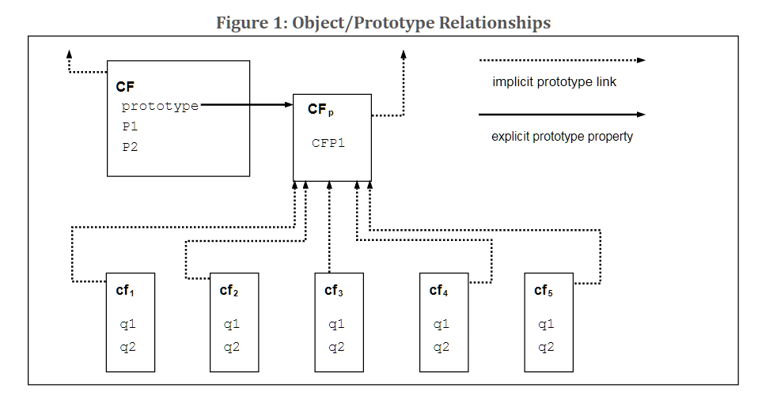

# 1. Alcance  
*Scope*

Este estándar define el lenguaje de programación de propósito general ECMAScript 2017.

# 2. Conformidad

Una implementación conforme de ECMAScript debe proporcionar y soportar todos los tipos, valores, objetos, propiedades, funciones, y semántica y sintáxis de programación descritas en esta especificación.

Una implementación conforme de ECMAScript debe interpretar texto fuente de conformidad con la última versión del estándar Unicode ISO/IEC 10646.

Una implementación conforme de ECMAScript que proporcione una interfaz de aplicación de programación que soporte programas que necesitan adaptarse a las convenciones lingüísticas y culturales de los distintos países, debe implementar la interfaz definida por la más reciente edición del estándar ECMA-402 que sea compatible con esta especificación. 

Una implementación conforme de ECMAScript puede proporcionar tipos, valores, objetos, propiedades y funciones adicionales más allá de las definidas en esta especificación. En particular, una implementación conforme de ECMAScript puede proporcionar propiedades que no están descritas en esta especificación, y valores para esas propiedades, para objetos que si están descritos en esta especificación.

Una implementación conforme de ECMAScript puede soportar síntaxis de programación y de expresiones regulares no descritas en esta especificación. En particular, una implementación conforme de ECMAScript puede soportar síntaxis de programación que hace uso de "futuras palabras reservadas" de las listadas en la subcláusula 11.6.2 de esta especificación.

Una implementación conforme de ECMAScript no debe implementar ninguna extensión que esté listada como "Extensión prohibida" en la subcláusula 16.2

# 3. Rerencias normativas

Los documentos referenciados a continuación son indispensables para la aplicación de este documento. Para referencias fechadas, solo la edición citada aplica. Para referencias no fechadas, la última edición del documento (correcciones incluidas) referenciado aplica.

ISO/IEC 10646:2006: *Information Technology - Universal Multiple-Octet Coded Character Set (UCS) plus Amendment 1:2005, Amendment 2:2006, Amendment 3:2008, and Amendment 4:2008* más las correcciones adeicionales, o sucesoras. 

ECMA-402, *ECMAScript 2015 International API Specification*.
http://www.ecma-international.org/publications/standards/Ecma-402.htm

ECMA-404, *The Json Data Interchange Format*.
http://www.ecma-international.org/publications/standars/Ecma-404.htm

# 4. Vista general

Esta sección contiene una revisión general no normativa del lenguaje ECMAScript.

ECMAScript es un lenguaje de programación orientado a objetos para realizar computación y manipular objetos computacionales dentro de un ambiente anfitrión. ECMAScript tal como está definido aquí, no está considerado como un lenguaje computacionalmente autosuficiente; de hecho, en esta especificación no hay provisiones para la entrada de datos externos o para la salida de los resultados computados. En vez de eso, se espera que el entorno computacional de un programa ECMAScript suministre no solo los objetos y los otros recurso descritos en esta especificación, sino también ciertos objetos entorno-específicos, cuya descripción y comportamiento están más allá del alcance de esta especificación excepto para indicar que ellas pueden proveer ciertas propiedades que pueden ser accedidas y ciertas funciones que pueden ser llamadas desde un programa ECMAScript.

ECMAScript fue originalmente diseñado para ser usado como un lenguaje de scripting, pero ha llegado a ser ampliamente usado como un lenguaje de programación de propósito general. Un *lenguaje de scripting* es una lenguaje de programación que es usado para manipular, personalizar y automatizar ciertas facilidades en un sistema existente. En tales sistemas, la funcionalidad básica ya está disponible a través de una interfaz de usuario, y el lenguaje de scripting es una mecanismo para exponer esa funcionalidad al control del programa. En este sentido, se dice del sistema existente que provee el entorno anfitrión de objetos y recursos, los cuales completan las capacidades del lenguaje de scripting. Un lenguaje de scripting está pensado para ser usado tanto por programadores profesionales como por aficionados.

ECMAScript fue originalmente diseñado para ser un *lenguaje de scripting Web*, entregando un mecanismo para animar páginas web en navegadores y para realizar computos de lado del servidor como parte de una arquitectura cliente-servidor basada en web. ECMAScript hoy es utilizado para proveer capacidades de scripting basico para una variedad de entornos anfitriones. Por lo tanto, el núcleo del lenguaje es especificado en este documento aparte de cualquier ambiente anfitrión en particular.

El uso de ECMAScript ha superado el simple scripting y hoy es utilizado para un completo espectro de tareas en muchos entornos distintos y escalas. Así como el uso de ECMAScript se ha expandido, así también lo han hecho sus características y los recursos que entrega. ECMAScript es hoy un completo lenguaje de programación de propósito general.

Algunos de los recursos del ECMAScript son similares a aquellos usados en otros lenguajes de programación; en particular C, JavaTM, Self y Scheme tal como son descritos en:

ISO/IEC 9899:1996, *Programming Languages - C*.

Gosling, James, Bill Joy and Guy Steele. *The JavaTM Language Specification*. Addison Wesley Publishing Co., 1996.

Ungar, David, and Smith, Randall B. Self: The Power of Simplicity. *OOPSLA '87 Conference Proceedings,* pp.227-241, Orlando, FL, October 1987.

*IEEE Standard for the Scheme Programming Language*. IEEE Std. 1178-1990.

## 4.1 Scripting Web
4.1 Web Scripting

Un navegador web provee un entorno anfitrión a ECMAScript para la computación de lado del cliente, incluyendo por ejemplo, objetos que representan ventanas, menus, pop-ups, cajas de diálogo, areas de texto, enlaces, cuadros, historial, *cookies*, y entrada y salida de datos. Aún mas, el entorno anfitrión entrega una manera de anexar código de scripting a eventos como el cambio de foco, carga de páginas e imágenes, descargas, errores y cancelaciones, selección, envío de formularios, y acciones del mouse. El código de scripting aparece dentro del html y la página desplegada es una combinación de elementos de interfaz de usuario, y texto e imágenes fijas y *dinámicas*. (sic: computed). El código de scripting es reactivo a la interacción del usuario, y no hay necesidad de un programa central. 

Un servidor web otorga un entorno anfitrión distinto para computación de lado del servidor, incluyendo objetos representando requests, clientes y archivos; y mecanismos para asegurar y compartir datos. Al usar scripting de lado del servidor y del cliente, es posible distribuir los procesos entre el cliente y el servidor mientras se provee una interfaz de usuario personalizada para una aplicación basada en web.

Cada navegador web y servidor que soporta ECMAScript suministra su propio entorno anfitrión, completando el entorno de ejecución ECMAScript.

## 4.2 Revisión general de ECMAScript.  
4.2 ECMAScript Overview 

La siguiente es un repaso general de ECMAScript -no todas las partes del lenguaje son descritas. Este vista no es parte del estándar propiamente tal.

ECMAScript es basado en objetosobject-based: el lenguaje básico y los recursos del anfitrión son provistos por objetos, y un programa ECMAScript es un racimocluster de objetos comunicantes. En ECMAScript, un *objeto* es una colección de cero o más *propiedades* cada una con *atributos* que determinan còmo puede ser usada cada propiedad -por ejemplo, cuando el atributo `Writable` de una propiedad es configurado a **false**, cualquier intento de ejecutar código ECMAScript que asigne un valor diferente a esa propiedad fallará. Las propiedades son contenedores que mantienen otros objetos, *valores primitivos*, o *funciones*. Un valor primitivo es un miembro de uno de los siguientes tipos incorporados: **Undefined, Null, Boolean, Number, String, Symbol**; un objeto, por su parte, es miembro del tipo incorporado **Object**, y una función es una objeto llamable. Una función que es asociada con un objeto a través de una propiedad es llamada *método*.

ECMAScript define una colección de *objetos incorporados* que completan la definición de las entidades ECMAScript. Estos objetos incorporados incluyen el **objeto global**; objetos que son fundamentales para las semánticas en tiempo de ejecución del programa, incluyendo **Object, Function, Boolean, Symbol**, y varios objetos de **Error**; objetos que representan y manipulan valores numéricos incluyendo **Math, Number** y **Date**, los objetos de procesado de texto **String** y **RegExp**; objetos que son colecciones indexadas de valores incluyendo el **Array** y nueve tipos diferentes de Array tipadosTyped Array cuyos elementos tienen todos, una representación de datos numéricos específica; colecciones con clave incluyendo **Map** y **Set**; objetos que soportan datos estructurados, incluyendo el objeto **JSON, ArrayBuffer, SharedArrayBuffer** y **Dataview**; objetos que soportan abstracciones de control, como los generadores de funciones y **Promise**, y objetos de reflexión incluyendo **Proxy** y **Reflect**. 

ECMAScript también define un conjunto de *operadores* incorporados. Los operadores ECMAScript incluyen varios operadores unarios, operadores multiplicativos, aditivos, de desplazamiento de bit a bit, operadores relacionales, de igualdad, operadores binarios de bit a bit, operadores lógicos binarios, operadores de asignación y el operador coma. 

Grandes programas ECMAScript son soportados mediante *módulos*module, los cuales permiten a un programa ser dividido en múltiples secuencias de sentencias y declaraciones. Cada módulo identifica explícitamente las declaraciones que va a usar desde otro módulo y cuáles de sus declaraciones van a estar disponibles para ser usadas por otros módulos. 

La sintaxis de ECMAScript se parece intencionalmente a la sintaxis de Java. La sintaxis de ECMAScript se ha relajado para hacerlo apropiado para servir como un lenguaje de scripting fácil de usar. Por ejemplo, una variable no requiere declarar su tipo o los tipos asociados con sus propiedades, y las funciones definidas no requieren tener declaraciones antes de ser llamadas.

### 4.2.1 Objetos
objects

Aun cuando ECMAScript incluye sintaxis para la definición de clases, los objetos ECMAScript no están basados fundamentalmente en clases, tales como aquellos en C++, Smalltalk, o Java. En vez de eso, los objetos pueden ser creados de varios maneras incluyendo una notación literal, a traves de *constructors* los cuales crean objetos y luego ejecutan código que los inicializa total o parcialmente a traves de la asignación inicial de valores a sus propiedades. Cada constructor es una función que tiene una propiedad llamada `prototype`que es usada para implementar herencia basada en prototipo y propiedades compartidas. Los objetos son creados utilizando los constructores en expresiones `new`; por ejemplo, `new Date(2009,11)` crea un nuevo objeto del tipo `Date`. El invocar un constructor sin utilizar la palabra `new` tiene consecuencias que dependen del constructor. Por ejemplo, `Date()` produce una String representativa de la fecha y hora actual en vez del objeto requerido.

Cada objeto creado por un constructor tiene un referencia implícita al valor de la propiedad `prototype` de su constructor (llamado el *prototipo* del objeto). Además, un prototipo puede tener una referencia *non-null* a su prototipo, y así, consecutivamente; esto es llamado "*String de prototipos*". Cuando una referencia es hecha a la propiedad en un objeto, esa referencia apunta a la propiedad con ese nombre en el primer objeto en la String de prototipos que tenga ese nombre. En otras palabras, primero se examina directamente el objeto mencionado en busca de esa propiedad; si ese objeto contiene aquella propiedad, esa será la propiedad a la que apuntará la referencia; si el objeto no contiene una propiedad con tal nombre, el prototipo de ese objeto es examinado a su vez, y asi. 

En un lenguaje orientado a objetos basado en clases, en general, el estado de portado por instancias, los métodos son portados por clases, y la herencia es solo de estructura y comportamiento. En ECMAScript, el estado y los métodos son portados por objetos, mientras que la estructura, el comportamiento y el estado, son todos heredados.

Todos los objetos que no contienen directamente una propiedad que su prototipo si contiene, comparten esa propiedad y su valor. 

Tal como lo ilustra la figura 1:

**CF** es un constructor (y también un objeto). Se han creado 5 objetos usando la expresion `new`: **cf1, cf2, cf3, cf4, cf5**. Cada uno de estos objetos contiene propiedades llamadas **q1** y **q2**. Las líneas punteadasm representan una relación de prototipado implícito; así, por ejemplo, el prototipo de **cf3** es **CFp**. El constructor, **CF**, tiene dos propiedades, llamadas **P1** y **P2**, las cuales no son visibles a **CFp**, **cf1, cf2, cf3, cf4**, o **cf5**. La propiedad llamada **CFP1** en **CFp** es compartida por **cf1, cf2, cf3, cf4**, y **cf5**, pero no por **CF**, asi como cualquier propiedad encontrada en la String de prototipado implícito de **CFp** que no sean **q1**, **q2** y **CFP1**. Observe que no hay una relación de prototipado implícito entre **CF** y **CFp**.

A diferencia de la mayoría de los lenguajes basados en clases, las propiedades pueden ser añadidas a los objetos dinámicamente asignándoles valores. Esto quiere decir, que los constructores no están obligados a asignarle valores a cualquiera o ninguno de las propiedades de un objeto. El el diagrama anterior, uno puede añadir una nueva propiedad compartida para **cf1, cf2, cf3, cf4**, y **cf5** asignándole un valor a una nueva propiedad en **CFp**.

Aunque los objetos ECMAScript no son intrínsecamente objetos basados en clase, casi siempre es conveniente definir abstracciones similares a clases sobre patrones comunes para funciones constructor, objetos `prototype` y métodos. Los mismos objetos incorporados en ECMAScript siguen este patrón similar a clases. Comenzando con ECMAScript 2015, el lenguaje ECMAScript incluye definiciones sintácticas de clase que permiten a los programadores definir de manera concisa objetos que se ajustan al mismo patron de abstracción similar a clases que es usado en los objetos incorporados. 

### 4.2.2 La variante estricta de ECMAScript

ECMAScript reconoce la posibilidad de que algunas usuarios del lenguaje deseen restringir el uso de algunas de las características disponibles en este. Ellos podrían querer hacerlo interesados en la seguridad, o para evitar ciertas características del lenguaje que se considera que propenden a errores, o para tener un control de errores mejorado, o por cualesquiera otros motivos de su elección. Para soportar esta posibilidad, ECMAScript define una variante estricta del lenguaje. La variante estricta del lenguaje excluye algunas características sintácticas y semánticas del lenguaje regular y modifica la semántica detallada de otras características. La variante estricta también especifica condiciones adicionales de error, que arrojan excepciones en situaciones que no están especificadas como errores por la forma no estricta del lenguaje.

La variante estricta del ECMAScript es comúnmente conocida como el *strict mode*. La selección del modo estricto y el uso de su sintaxis y semánticas son hechas explícitamente en el nivel de unidades de texto fuente individuales. Debido a que el modo estricto es elegido al nivel de sintaxis de la unidad de texto fuente, este solo impone sus restricciones con efecto local dentro de aquella unidad de texto fuente. El modo estricto no restringe ni modifica ningún aspecto de las semánticas de ECMAScript, que pueden operar consistentemente a través de múltiples unidades de texto fuente. Un programa completo ECMAScript puede estar compuesto de unidades de texto fuente de ambos modos, estricto y no estricto. En este caso, el modo estricto solo aplica cuando se está ejecutando código que está definido dentro de una unidad de texto fuente escrita en modo estricto.

Para ajustarse a esta definición, una implementación ECMAScript debe implementar ambos modos de ECMAScript, el estricto y el el no estrito, tal como están definidos en esta especificación. Además, una implementación conforme debe soportar la combinación de unidades de texto fuente en modos estricto y no estricto dentro un solo programa. 

## 4.3 Términos y definiciones

Para los propósitos de este documento, los siguientes términos y definiciones aplican: 

### 4.3.1 Tipo

o *type* es un conjunto de valores tal como están definidos en la cláusula 6 de esta especificación.

### 4.3.2 valor primitivo

*primitive value* es miembro de unos de los siguientes tipos: **Undefined, Null, Boolean, Number, Symbol**, o **String**, tal cual están definidos en la cláusula 6.

> NOTA: un valor primitivo es un *datum* que se representa directamente en el nivel más bajo posible de la implementación.

### 4.3.3 objeto

*object* es un miembro del tipo `Object`.

> NOTA: un objeto es una colección de propiedades y tiene un solo objeto `prototype`. El valor de este `prototype` puede ser `Null`.

### 4.3.4 constructor

es una función que crea e inicializa objetos

> NOTA: el valor de la propiedad `prototype` de un constructor es un objeto prototipo que es usado para implementar herencia y propiedades compartidas. 

### 4.3.5 prototipo

*prototype*, es un objeto que provee propiedades compartidas para otros objetos.

> NOTA: Cuando un constructor crea un objeto, aquel objeto implícitamente hace referencia a la propiedad de su constructor `prototype`con el propósito de resolver las referencias a las propiedades. La propiedad del constructor `prototype` puede ser referenciada por la expresión del programa `constructor.prototype`, y las propiedades añadidas a un objeto `prototype` son compartidas, a través de herencia, por todos los objetos que comparten el prototipo. De manera alternativa, un nuevo objeto puede ser creado con un prototipo explícitamente especificado usando la función incorporada `Object.create`.

### 4.3.6 objeto ordinario

*ordinary object*, es un objeto que tiene el comportamiento por defecto para los métodos internos esenciales que son soportados por todos los objetos.

### 4.3.7 exotic object

*exotic object*, es un objeto que no tiene el comportamiento por defecto para uno o más de sus métodos internos esenciales. 

### 4.3.8 objeto estandar

*standar object*, es un objeto cuyas semánticas son aquellas definidas por esta especificación.

### 4.3.9 objeto incorporado

*built-in object*, es un objeto definido y suministrado por una implementación ECMAScript.

> NOTA: los objetos incorporados estándar son los definidos en esta especificación. Una implementación ECMAScript puede especificar y suministrar clases adicionales de objetos incorporados. Un *constructor incorporado* es un objeto incorporado que también es un constructor. 

### 4.3.10 valor undefined

*undefined value*, es un valor primitivo usado cuando a una variable no se le ha asignado ningún valor. 

### 4.3.11 tipo Undefined 

*Undefined type*, es el tipo cuyo único valor es el valor undefined.

### 4.3.12 valor null

*null value*, es un valor primitivo que reprensenta la ausencia intencional de cualquier valor para un objeto. 

### 4.3.13 tipo Null

*Null type*, es el tipo cuyo único valor es el valor null.

### 4.3.14 valor Boolean

*Boolean value*, miembro del tipo Boolean.

> NOTA: Solo existen dos valores booleanos: true y false.

### 4.3.15 tipo Boolean

*Boolean type*, tipo consistente de los valores primitivos true y false.

### 4.3.16 objeto Boolean

*Boolean object*, miembro del tipo Booleano que es una instancia del constructor estándar incorporado `Boolean`.

> NOTA: un objeto Booleano es creado utilizando el constructor `Boolean` en una expresión `new`, suministrando un valor booleano como argumento. El objeto resultante tiene una "ranura interna" [(ver)][glosario_4_001]

### 4.3.17 valor String

*String value*, es un valor primitivo que es un secuencia finita ordenada de cero o más valores enteros de 16 bits unsigned.

> NOTA: Una valor String, es un miembro del tipo String. Cada valor entero en la secuencia usualmente representa una sola unidad de texto UTF-16 de 16 bits. Sin embargo, ECMAScript no impone ninguna restricción o requerimiento a los valores excepto que ellos deben ser enteros de 16 bits unsigned.

### 4.3.18 tipo String

*String type*, es el conjunto de todos los valores posibles de String, tal como están definidos en 4.3.17

### 4.3.19 objeto String

*String object*, es miembro del tipo String, que es una instancia del constructor estándar incorporado `String`.

> NOTA: un objeto String es creado utilizando el constructor `String` en una expresión `new`, suministrando un valor String como argumento. El objeto resultante tiene una ranura interna [(ver)][glosario_4_001] cuyo valor es un valor String. Un objeto String puede ser forzado en un valor String llamando el costructor `String` como una función. (21.1.1.1)

### 4.3.20 valor Number

*Number value* es un valor primitivo que corresponde a un valor binario de doble precisión de 64 bits de formato IEEE 754-2008.

> NOTA: un valor Number es un miembro del tipo Number y es una representación directa de un número.

### 4.3.21 tipo Number

*Number type*, es el conjunto de todos los valores `Number` posibles, incluyendo los valores especiales "Not-a-Number" (NaN), el infinito positivo, y el infinito negativo.

### 4.3.22 objeto Number

*Number object*, miembro del tipo Object que es una instancia del constructor estándar incorporado `Number`.

> NOTA: un objeto Number es creado usando el constructor `Number` en una expresión `new` y suministrando un valor Number como argumento. El objeto resultante tiene una ranura interna [(ver)][glosario_4_001] cuyo valor es un valor number. Un objeto Number puede ser forzado a un valor number usando el constructor `Number` como una función. (20.1.1.1)

### 4.3.23 Infinity

valor numérico que corresponde al valor numérico infinito positivo.

### 4.3.24 NaN

valor numérico que corresponde al valor "Not-a-Number" según IEEE 754-2008.

### 4.3.25 valor Symbol

*Symbol value*, es un valor primitivo que representa a un único *non-String* que es una clave de propiedad.

### 4.3.26 tipo Symbol

*Symbol type*, es el conjunto de todos los posibles valores de Symbol.

### 4.3.27 objeto Symbol

miembro del tipo objeto que puede ser una instancia del constructor estándar incorporado `Symbol`.

### 4.3.28 función

*function*, es un miembro del tipo Object que puede ser invocado como una subrutina.

> NOTA: En adición a sus propiedades, una función contiene código ejecutable y estado que determinan como se comporta cuando es invocada. El codigo de una función puede o no estar escrito en ECMAScript.

### 4.3.29 función incorporada

*built-in function*, es un objeto incorporado que es una función.

> NOTA: Ejemplos de funciones incorporadas incluyen `parseInt` y `Math.exp`. Una implementación puede suministrar funciones incorporadas dependientes de esa implementación, que no están descritas en esta especificación.

### 4.3.30 propiedad

*property, parte de un objeto que asocia una clave (ya sea un valor `String` o un valor `Symbol`) con un valor.

> NOTA: dependiendo de la forma de la propiedad, el valor puede ser representado ya sea directamente por un valor de dato (un valor primitivo, objeto o una función) o indirectamente por un par de funciones accesoras.

### 4.3.31 método

*method*, es una función que es el valor de una propiedad.

> NOTA: cuando una función es llamada como método de un objeto, el objeto es pasado a la función como su valor `this`.

### 4.3.32 metodo incorporado

*built-in method*, método que es una función incorporada

> NOTA: los métodos estándar incorporados son definidos en esta especificación, y una implementación ECMAScript puede especificar y suministrar otros métodos incorporados adicionales. 

### 4.3.33 atributo

*attribute*, valor interno que define alguna característica de una propiedad.

### 4.3.34 propiedad propia

*own property*, propiedad que está directamente contenida por su objeto.

### 4.3.35 propiedad heredada

*inherit property*, propiedad de un objeto que no es una propiedad propia sino una propiedad (propia o heredada a su vez) del prototipo del objeto.

## 4.4 Organización de esta especificación

*Organization of this especification*

Lo que queda de esta especificación está organizado como sigue: 

- La cláusula 5 define las convenciones de notación usadas a través de esta especificación.
- Las cláusulas 6 a la 9, definen el entorno de ejecución dentro del cual operan los programas ECMAScript.
- Las cláusulas 10 a la 16, definen la especificación del lenguaje mismo ECMAScript, incluyendo la codificación sintáctica y las semánticas de ejecución de todas las características del lenguaje.
- Las cláusulas 17 a la 26, definen la biblioteca estándar de ECMAScript. Ellas incluyen las definiciones de todos los objetos estándar que están disponibles para el uso en los programas ECMAScript que los ejecuten. 

[glosario_4_001]: www.aca-va-un-enlace-o-referencia-cruzada-a-internal-slot.com 
